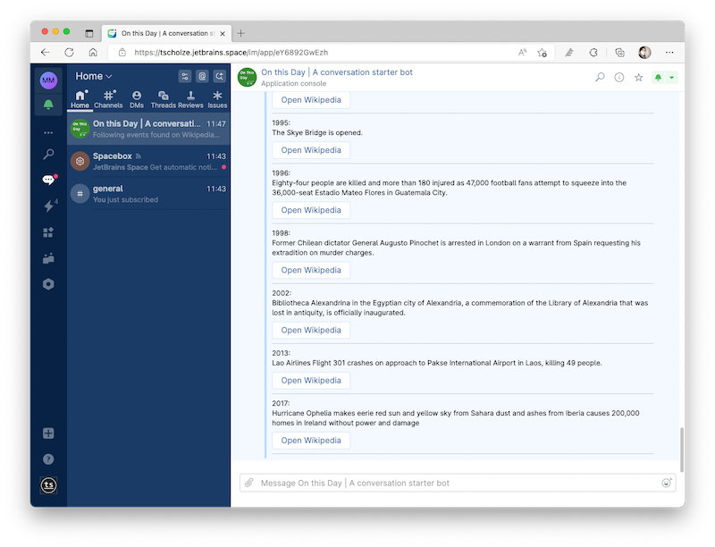

# kotlin-spaces-app-onthisday
> On this day is a JetBrains Space app which shows Wikipedia-based information about what happened on that or given day

## tl;dr
"On this day" is my beginner-level submission to [JetBrains Space App Contest](https://blog.jetbrains.com/space/2022/08/09/space-apps-contest/) and also a real-world "Kotlin learning" exercise. This is not meant to be a real word bot that lives forever.

## What?
This is my very first JetBrains Space application. It's mainly a simple chat bot that requests data from [Albin Larsson](https://byabbe.se/)'s [open Wikipedia API](https://byabbe.se/on-this-day/#/default/get__month___day__events_json) and renders it in a DM reply.

You can install it from the [JetBrains Plugin Marketstore page](https://plugins.jetbrains.com/plugin/20132-on-this-day--a-conversation-starter-bot)

## Features
Following commands are supported:
- `otd`: Presents you the **events** on **today's** day in history
- `otd 14.03`: Presents you the **events** on **14.03** *(dd.MM)* in history 
- `otd 14.03 events | deaths | birth`: Presents you the **given topic** on **14.03** *(dd.MM)* in history
- Allows open Wikipedia from given message

## Message UI

## Special thanks to
- [David Herman](https://twitter.com/bitspittle) (Bitspittle) for helping me to get started with Kotlin
- [Albin Larsson](https://byabbe.se/on-this-day/#/default/get__month___day__events_json) for providing an open API to easily fetch Wikipedia information

## Keep in mind
This app is purely build for having fun! All features have room for improvements or could be done more elegant. This app was and may never be meant to run in production-like environments.
If you see any tokens, keys or secrets, you can be sure that all of these are already revoked.

## Authors
Just me, [Tobi]([https://tscholze.github.io).

## Links
- [JetBrains Space](https://www.jetbrains.com/space/) homepage
- [JetBrains Space App Contest](https://blog.jetbrains.com/space/2022/08/09/space-apps-contest/) homepage

## License
This project is licensed under the MIT License - see the [LICENSE](LICENSE) file for details.
Dependencies or assets maybe licensed differently.
